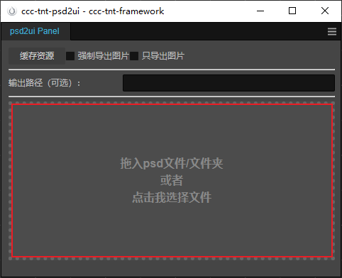

# psd转预制体
### 介绍
将 psd 转为可以直接在 cocos 中使用的预制体，并导出图片资源。  
前提是需要在 Photoshop 中根据文档做好图层的处理。  
美术同学把效果做好，我们只需要调整一下图层就可以了。  
大大提升了预制体制作的效率  

插件文件夹提供了一个能够正确导出为预制体的的 psd 文件可以作为参考  `test\demo.psd` 

支持的 CocosCreator 版本：`3.4.+` ，截止到目前可以支持到 `3.7.x`  
如果无法拖放 psd 文件或文件夹，可能是 CocosCreator 的权限不够，尝试使用管理员方式打开 CocosCreator 或者使用 打开文件 功能


### 工具特性
相同的图像只会导出一张图片  
如果是相同的图像但是大小不同，则可以使用 `bind` 功能进行绑定，具体使用可以字段说明和示例文件  
如果是相同的图像但是旋转角度不同，则会导出多张旋转角度不同的图片，需要手动去 Cocos 中处理旋转

工具在导出资源的时候会将图片的 MD5 值写入到缓存文件，当其他 psd 有相同 MD5 值的图片时，不再导出图片  
工具在首次使用时会自动执行一次缓存项目所有资源 MD5 值  
美术导出的图片 MD5 值可能与本工具导出的图片 MD5 值不一致，所以当出现相同的图片时请考虑这种情况

### 特别注意
工具只适用于新界面的首次导出，如果界面已经开发到一定程度，但是因需求变化，界面结构发生变化，想重新导出，需要谨慎使用。
如果导出之后缺少某些图片，请确认是否写入了缓存，写入缓存的不会重新导出。  
如果出现资源丢失的情况，请确认在项目中是否被手动删除了。  
不建议将输出目录设置为 项目的 `assets` 文件夹下，可能由于编辑器的权限导致不可预期的错误。


### Mac 用户请注意！！！！
Mac 下首次使用需要先执行根目录下的 `install_depends.sh` 安装 `canvas` 所需要的依赖，如果安装错误 请根据 `https://github.com/Automattic/node-canvas` 手动安装


#### 界面说明



1. 缓存资源按钮： 手动缓存资源MD5，当你不确定资源是否完全缓存的时候可以执行
2. 强制导出图片选项： 勾选后，即使已经进行缓存的资源同样会导出图片
3. 只导出图片选项： 可以把此工具只当做是切图工具，同时会将文本图层的字号及颜色输出到文件
4. 输出路径输入框： 可以直接导出到指定路径，如果没有填写，默认为 psd 同级目录
5. 红框区域：拖入 psd 文件夹或 psd 文件，也可以点击红框区域使用选择文件功能

### 属性

<a href="#Btn"> @Btn | @btn 按钮</a>

<a href="#ProgressBar"> @ProgressBar | @progressBar 进度条</a>

<a href="#Toggle"> @Toggle | @toggle 选项按钮</a>

<a href="#png9"> @.9 九宫格</a>

<a href="#ar"> @ar 锚点</a>

<a href="#size"> @size 尺寸</a>

<a href="#full"> @full 全屏</a>

<a href="#scale"> @scale 缩放</a>

<a href="#ignore"> @ignore | @ig 忽略导出图片和节点</a>

<a href="#ignorenode"> @ignorenode | @ignode 忽略导出节点</a>

<a href="#ignoreimg"> @ignoreimg | @igimg 忽略图片</a>

<a href="#img"> @img 图片选项</a>

<a href="#flip"> @flip 翻转图像</a>

<a href="#flipX"> @flipX 翻转图像 (flip 变种)</a>

<a href="#flipY"> @flipY 翻转图像 (flip 变种)</a>


### 组件

<a id="Btn"></a>
```
@Btn || @btn

作用图层: 所有图层
```

<a id="ProgressBar"></a>
```
@ProgressBar || @progressBar
作用图层: 组图层

@bar 

bar 为 ProgressBar 的属性，类型为 Sprite
作用图层: 图像图层
```

<a id="Toggle"></a>
```
@Toggle || @toggle
作用图层: 组图层

@check

check 为 Toggle 的属性，类型为 Sprite
作用图层: 图像图层


```

### Field


<a id="png9"></a>
```
@.9{l:0,r:0,b:0,t:0}  

九宫格
作用图层: 图像图层

参数：
    l = left
    r = right
    b = bottom
    t = top
    ps: 
        l r 只填写其中一项，则为对称
        b t 同上
        不填写则默认为 0
```

```
@ar{x:0,y:0}

锚点
作用图层: 所有图层

参数：
    参数都为可选
    不填写则默认为 0.5

```

<a id="size"></a>
```
@size{w:100,h:100}

节点尺寸 非图片尺寸
作用图层: 所有图层

参数：
    w?: 宽
    h?: 高
    只对填写的参数生效，未填写的则为计算到的值
    无参数不生效
    
```

<a id="full"></a>
```
@full

节点设置为全屏尺寸
作用图层: 组图层

```

<a id="scale"></a>
```
@scale{x:1,y:1}

节点缩放
作用图层: 所有图层

参数：
    x?: x 方向
    y?: y 方向
    只对填写的参数生效，未填写的则为 1 
    
```

<a id="ignore"></a>
```
@ignore
@ig

忽略导出图像和节点
作用图层: 所有图层
```

<a id="ignorenode"></a>
```
@ignorenode
@ignode

忽略导出节点
作用图层: 所有图层
```

<a id="ignoreimg"></a>
```
@ignoreimg
@igimg

忽略导出图像
作用图层: 图像图层
```

<a id="img"></a>
```
@img{name: string,id: 0,bind: 0}

定制图片
作用图层：图像图层

参数：
    id: number 可选 当前文档中图片唯一 id
    name: string 可选 导出的图片名
    bind: number 可选 绑定 图像 id
```

<a id="flip"></a>
```
@flip{bind: 0, x: 0, y: 0}

镜像图像
作用图层：图像图层

参数：
    bind: number 必选 被绑定的图片 需要用  @img{id:number} 做标记
    x: 0 | 1, 可选， 1 为 进行 x 方向镜像
    y: 0 | 1, 可选， 1 为 进行 y 方向镜像
    x,y 都缺省时，默认 x 方向镜像

注意：
    @flip 的图层不会导出图像
```

<a id="flipX"></a>
```
@flipX{bind: 0}

flip 的变种 x 方向镜像图像
作用图层：图像图层

参数：
    bind: number 必选 被绑定的图片 需要用  @img{id:number} 做标记
 
注意：
    @flipX 的图层不会导出图像
```

<a id="flipY"></a>
```
@flipY{bind: 0}

flip 的变种 y 方向镜像图像vv
作用图层：图像图层

参数：
    bind: number 必选 被绑定的图片 需要用  @img{id:number} 做标记
 
注意：
    @flipY 的图层不会导出图像
```


### 说明
    多个字段可作用在同一个图层上，按需使用


#### 例如
```
节点名@Btn@size{w:100,h:100}

节点名@ar{x:1,y:1}@full@img{name:bg}
```


## 注意事项
### 美术
- 智能图层  支持 
- 蒙版，形状这些图层需要栅格化，或转为智能图层使用  
- 图层样式
  - 颜色叠加： 文本图层支持，图像图层不支持
  - 描边： 文本图层支持
  - 其他图层样式不支持

工具会把 画布外的图像也导出成图片，需要美术将 画布外 不需要导出的图像处理掉


### 程序配置
如果想对指定组件进行统一定制，可以修改 `psd2ui/config/psd.config.json` 文件  
key 为组件名，val 为 预制体参数，你可以对任意组件的任意属性进行定制

例如当你想在导出时默认使用指定字体：
```
cc2.4.x 可以配置为
{
    "cc.Label": {
        "_N$file":{
            "__uuid__": "7ecfa26a-27ec-4e2c-9815-d7c4c744d53f"
        },
        "_isSystemFontUsed": false
    }
}

cc3.7.x 可以配置为
"cc.Label": {
    "_font": {
        "__uuid__": "7ecfa26a-27ec-4e2c-9815-d7c4c744d53f",
        "__expectedType__": "cc.TTFFont"
        },
    "_isSystemFontUsed": false
}
// 以上这些配置会覆盖正常的属性数据，没有其他属性不受影响。


// 特殊配置
"textOffsetY":{
    "default": 0,
    "36": 0
},
"textLineHeightOffset": 0

// textOffsetY:  Label节点 Y 偏移，当你使用了定制的字体的时候，可能在 PS 中与 CocosCreator 中表现不一致，可以使用这个参数进行处理，字号为 key，偏移量为值

// textLineHeightOffset: Label节点行高增量，默认没有增量，行高默认为字体大小，当你想将行高统一高n个像素的时候可以使用这个配置

以字号为 key ，偏移值 为 val
如果没有配置 某些字号，则 使用 default 默认偏移值，如果没有配置 default， 偏移为 0

```

## 已知bug
使用 强制导出图片选项时，输入为多个 psd 或含有多个 psd 文件的文件夹时，如果在不同 psd 含有相同 md5 的图像，则会在各自目录下生成相同 uuid 的图片


## PS脚本
这里提供了一个图层重命名的 PS 脚本，可以批量对图层进行命名  

使用方式有两种：
1. 将脚本放入 PhotoShop文件夹中的 `\Presets\Scripts` 文件夹下，然后在 `Photoshop左上角-> 文件 -> 脚本-> PS脚本-图层重命名` 就行看到
2. 脚本放在任意位置，然后在 `Photoshop左上角-> 文件 -> 脚本-> 浏览` 在打开的选择文件弹窗选择找到我们的脚本

然后根据需求填入参数就行了

隐藏功能：
> 【替换】 选项可以实现批量替换  
> 例如有5个图层：  头，身体，手臂，手掌，大腿  
> 则界面上填入  
> 把：头,身体,手臂,手掌,大腿  
> 替换为：head,body,arm,palm,thigh


<font size=5 ><b> 
不要跟我说在 PS 里调整图层！！<br>
批量重命名！！<br>
强制导出！！<br>
一把梭哈！！<br>
我只要位置信息！！！<br>
</br></font>
